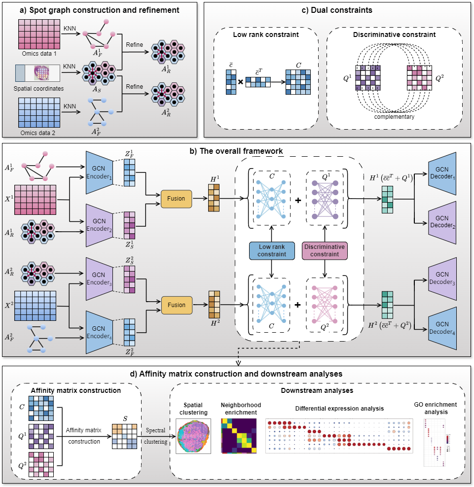

# SpaMICS:Identifying Spatial Domains from Spatial Multi-Omics Data Using Consistent and Specific Deep Subspace Learning
The source code and input data of SpaMICS



## Requirement
- torch==2.3.0
- python==3.8.17
- numpy==1.24.4
- pandas==1.5.3
- scikit-learn==1.3.2
- scanpy==1.9.7
- scipy==1.10.1
- anndata==0.9.2

## Usage
#### Clone this repo.
```
git clone https://github.com/SZU-CGC/SpaMICS.git
```

#### Example command
Take the dataset "Human_Lymph_Node_A1" as an example
```
python main.py --name "Human_Lymph_Node_A1"
```